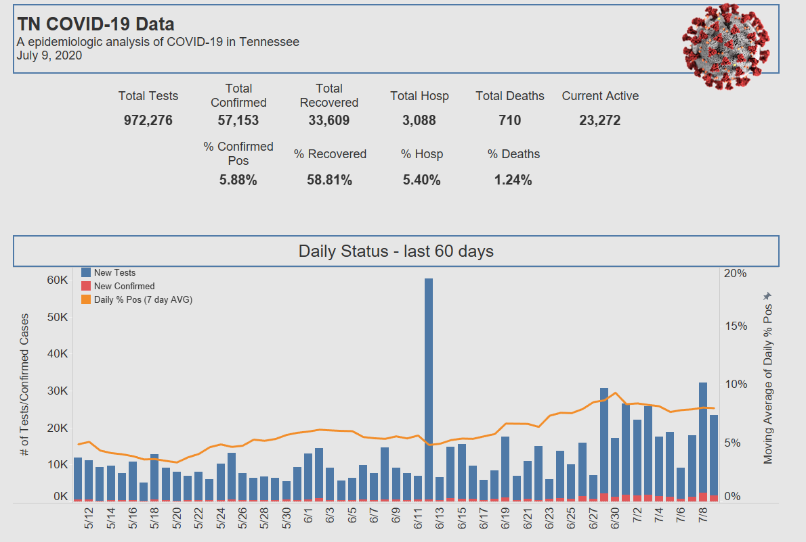

# TN-COVID-19

## Goal
The goal of this project is to take the datasets provided by the Tennessee Department of Heath and gleam insights from them using Tableau that shows the impact that COVID-19 is having to Tennessee in a historical and real time context.

## Tools Used

* **Tableau** for data visualization

[Click Here](https://public.tableau.com/views/TN-COVID-19V2/Dashboard?:language=en&:display_count=y&publish=yes&:origin=viz_share_link) to view my Tableau dashboard

## Project Screenshots

### Tableau Dashboard

